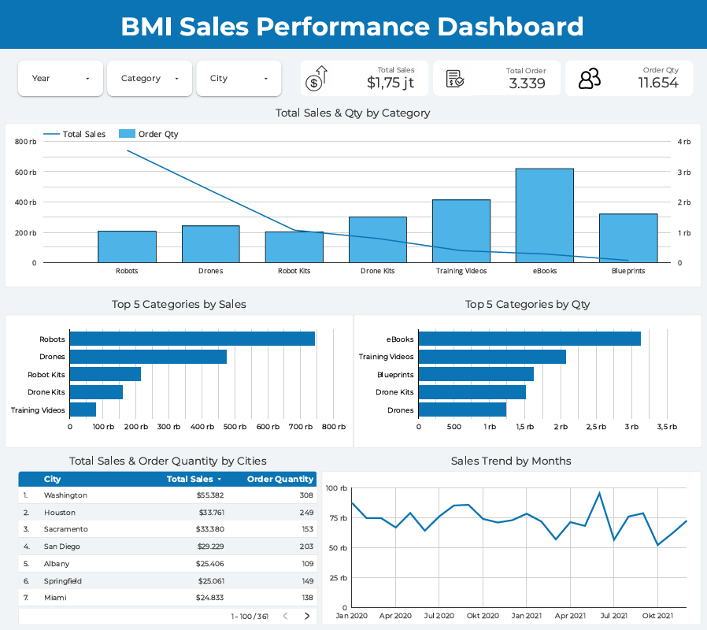
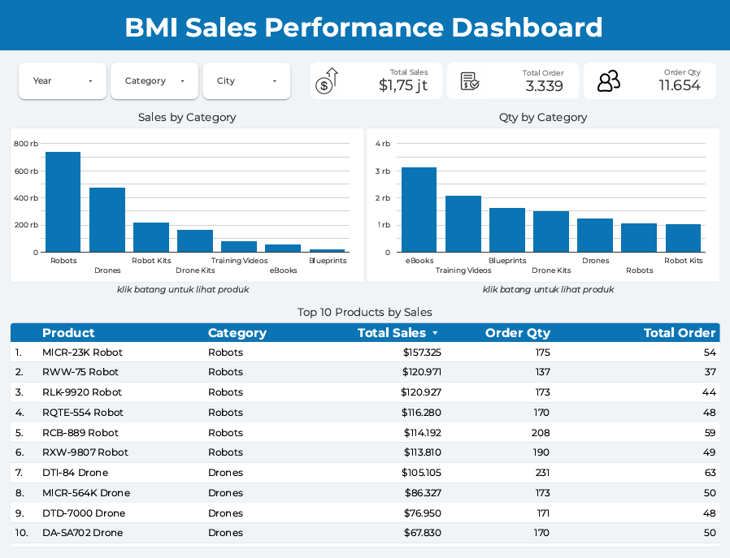

# BMI Sales Performance Dashboard

**Project-Based Virtual Internship — Business Intelligence Analyst**

Bank Muamalat x Rakamin Academy | October-November 2025

---

## Project Overview

### Page 1 — Overview


### Page 2 — Details


PT Sejahtera Bersama (Bank Muamalat) needed a data-driven approach to evaluate sales performance across products, customer segments, and cities. This project involved building a relational data model, integrating multiple datasets using SQL, and delivering a business intelligence dashboard with strategic recommendations.

---

## Objectives

- Identify primary keys and map entity relationships across 4 datasets
- Integrate datasets into a unified master table using SQL
- Build an interactive sales performance dashboard
- Deliver data-driven business recommendations

---

## Repository Structure

```
├── README.md
├── sql/
│   └── SQLQuery.sql                      # load notes, key/relationship checks, master table, dashboard checks, and analysis queries
└── dashboard/
    ├── overview.png
    └── details.png
```

---

## Dataset Structure

| Table | Primary Key | Rows | Description |
|---|---|---:|---|
| customers | CustomerID | 2,123 | Customer profile and location data |
| orders | OrderID | 3,339 | Transaction records with product and quantity |
| products | ProdNumber | 70 | Product name, category reference, and price |
| product_category | CategoryID | 7 | Product category names |

**Entity Relationships:**

- One Customer → Many Orders (One-to-Many)
- One Product → Many Orders (One-to-Many)
- One Category → Many Products (One-to-Many)

`orders` is the transaction (fact) table. All three relationships were validated and no orphan keys were found.

---

## Tools Used

- **Google BigQuery** — Data import, SQL execution, and master table creation
- **Google Looker Studio** — Dashboard and data visualization
- **SQL** — Data integration via multi-table JOINs

---

## Data Preparation Notes

- Source CSV files use a semicolon (`;`) delimiter and a decimal comma, so they were loaded with a custom delimiter and the header row skipped (load settings are documented at the top of [`sql/SQLQuery.sql`](sql/SQLQuery.sql)).
- The `products` table was loaded with all columns as `STRING`, because auto-detect read `9,99` as `999` and inflated sales by 100x. Prices are converted in SQL with `CAST(REPLACE(Price, ',', '.') AS FLOAT64)`.
- `CustomerEmail` in the raw data contains an appended `#mailto:...#` string, which is removed with `SPLIT(CustomerEmail, '#')[OFFSET(0)]`.
- The dataset does not specify a currency, so values are reported as plain numbers.

---

## SQL Query

The following query creates the master table by joining all 4 datasets:

```sql
CREATE OR REPLACE TABLE `rakamin-bmi.sejahtera.master_table` AS
SELECT
  CAST(o.Date AS DATE)                                                AS order_date,
  pc.CategoryName                                                     AS category_name,
  p.ProdName                                                          AS product_name,
  CAST(REPLACE(p.Price, ',', '.') AS FLOAT64)                         AS product_price,
  o.Quantity                                                          AS order_qty,
  ROUND(o.Quantity * CAST(REPLACE(p.Price, ',', '.') AS FLOAT64), 2)  AS total_sales,
  SPLIT(c.CustomerEmail, '#')[OFFSET(0)]                              AS cust_email,
  c.CustomerCity                                                      AS cust_city
FROM `rakamin-bmi.sejahtera.orders` o
JOIN `rakamin-bmi.sejahtera.products` p
  ON o.ProdNumber = p.ProdNumber
JOIN `rakamin-bmi.sejahtera.product_category` pc
  ON CAST(p.Category AS INT64) = pc.CategoryID
JOIN `rakamin-bmi.sejahtera.customers` c
  ON o.CustomerID = c.CustomerID
ORDER BY order_date, o.OrderID;
```

Validation: 3,339 rows, total sales 1,754,750.57, total quantity 11,654. The full set of validation, dashboard check, and analysis queries is in [`sql/SQLQuery.sql`](sql/SQLQuery.sql), together with the query above.

---

## Dashboard Summary

**Key Metrics (2020–2021):**

- Total Sales: 1,754,750.57
- Total Quantity Sold: 11,654 units
- Total Orders: 3,339
- Active Customers: 1,671 (of 2,123 registered)

**Sales by Category:**

| Category | Sales | Share | Quantity | YoY Sales |
|---|---:|---:|---:|---:|
| Robots | 743,505 | 42.4% | 1,053 | -15.4% |
| Drones | 477,447 | 27.2% | 1,227 | +3.3% |
| Robot Kits | 216,437 | 12.3% | 1,037 | -11.3% |
| Drone Kits | 161,243 | 9.2% | 1,515 | -5.8% |
| Training Videos | 80,716 | 4.6% | 2,081 | +0.9% |
| eBooks | 58,968 | 3.4% | 3,123 | +4.2% |
| Blueprints | 16,435 | 0.9% | 1,618 | -12.3% |

**Top Product Categories by Quantity:** eBooks, Training Videos, Blueprints, Drone Kits, Drones

**Top Cities by Sales:**

1. Washington — 55,382
2. Houston — 33,761
3. Sacramento — 33,380
4. San Diego — 29,229
5. Albany — 25,406

**Dashboard Components:** total sales scorecard; sales and quantity by category; sales and quantity by city; top 5 categories by sales and by quantity; 2020 vs 2021 category comparison; monthly Robots vs Drones trend; top products table; city comparison across years. Charts support drill-down from category to product and detailed tooltips.

---

## Key Insights

- **Sales declined 7.8%**, from 913,210 in 2020 to 841,540 in 2021. Robots alone account for about 87% of the drop (402,835 → 340,670, -15.4%).
- **Robots and Drones generate about 70% of sales** with only 20% of units, driven by high unit prices (about 706 per unit for Robots and 389 for Drones).
- **eBooks, Training Videos, and Blueprints make up 59% of units but only 8.9% of sales** (average order value of about 66 for eBooks versus 2,555 for Robots).
- **Sales are volatile for Robots:** monthly Robots sales ranged from 43,854 (June 2021) to 8,793 (October 2021), which made October 2021 the weakest month overall.
- **Several top cities are declining:** Birmingham fell about 95% (21,976 → 1,199), Sacramento about 69%, and Washington about 37% year over year.
- **Customer base is underused:** 452 of 2,123 customers (21%) never ordered, 40.5% of active customers only bought low-value categories, and the top 10% of customers contribute about 40% of sales.

---

## Recommendations

**1. Recover Robots and apply premium positioning**

Robots contribute 42.4% of sales but fell 15.4% in 2021. Prioritize the three best-selling products — MICR-23K Robot (157,325), RWW-75 Robot (120,971), and RLK-9920 Robot (120,927), together 54% of Robots sales — with premium positioning, and investigate the cause of the 2021 decline. For Drones, which grew 3.3%, highlight DTI-84 Drone, MICR-564K Drone, and DTD-7000 Drone.

**2. Inventory optimization with demand forecasting**

Start with high-value physical products: DTI-84 Drone (231 units), RCB-889 Robot (208 units), MICR-23K Robot (175 units), and RLK-9920 Robot (173 units). Build monthly demand forecasts, since Robots sales swing about 5x between peak and low months. eBooks, Training Videos, and Blueprints are assumed to be digital products and need no stock optimization.

**3. Cross-sell and upsell from low-value to high-value products**

40.5% of active customers only bought eBooks, Training Videos, or Blueprints, and only 32.5% ever bought Robots or Drones. Create an upgrade path from Blueprints (for example Sleepy Eye Blueprint, 312 units) to Robot Kits and Drone Kits, then to Robots and Drones. Offer bundles such as Drone Kits with the "Building Your Own Drone" eBook.

**4. City retention and focused geographic strategy**

Run retention campaigns in Washington, Birmingham, and Sacramento, which dropped sharply in 2021. Concentrate marketing budget on core states (California, Texas, Florida) instead of spreading across 361 cities, where the top 10 cities make up only 17% of sales.

**5. Customer activation and loyalty**

Send first-purchase vouchers to the 452 customers who never ordered, build a VIP program for the top 10% of customers (about 40% of sales), and encourage repeat orders among the 41% of active customers who bought only once.

**Limitations:** the data covers only two years and has no cost or margin information, so recommendations are based on sales and quantity rather than profitability.

---

## Author

**Refa Defanda Witanto**

International Relations, Universitas Brawijaya

[LinkedIn](https://www.linkedin.com/in/refa-defanda/) | <refadfnda@gmail.com>
